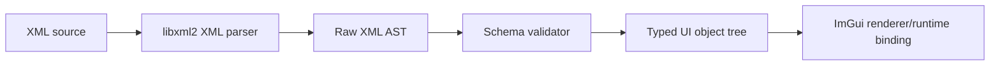

# Product Requirements Document: xml-imgui

## 1. Summary

`xml-imgui` is a C++ project that transforms XML UI declarations into structured C++ objects designed for Dear ImGui-based applications.

The initial use case is enabling frontend/UI authors to write XML layouts, then letting C++ engineers consume those layouts as validated object trees instead of manually constructing every ImGui widget in code.

## 2. Problem

Dear ImGui is powerful for C++ tooling, but UI layout is usually embedded directly in imperative C++ code. That makes iteration slower when designers, tooling engineers, or frontend developers want to experiment with layout and widget hierarchy.

This project separates UI description from runtime rendering logic:

- XML describes structure and static properties.
- C++ owns validation, binding, rendering, and runtime behavior.

## 3. Goals

- Parse XML into a typed intermediate representation.
- Support common ImGui widgets such as windows, text, buttons, inputs, checkboxes, sliders, menus, tabs, tables, and layout groups.
- Validate XML and report actionable errors with locations where possible.
- Provide a clean C++ API for loading XML from strings/files.
- Keep the core library independent from a specific application.
- Design the system so future code generation is possible but not required.

## 4. Non-Goals

- Replacing Dear ImGui.
- Implementing a complete browser-like XML/CSS layout engine.
- Supporting arbitrary HTML/CSS.
- Executing scripts embedded in XML.
- Solving asset packaging or hot reload in the first milestone.

## 5. Primary Users

- C++ tooling/application engineers using Dear ImGui.
- UI/frontend-oriented developers who prefer declarative markup.
- Teams that want faster iteration on internal tools and editor panels.

## 6. Proposed XML Shape

```xml
<Window id="main" title="Inspector">
  <Text value="Entity" />
  <InputText id="entity_name" label="Name" bind="entity.name" />
  <Checkbox id="visible" label="Visible" bind="entity.visible" />
  <Button id="apply" label="Apply" action="applyEntityChanges" />
</Window>
```

## 7. Initial Architecture



## 8. Core Components

- `parser`: Reads XML and produces a raw tree.
- `schema`: Defines allowed tags, attributes, types, and nesting rules.
- `model`: Holds typed C++ UI objects.
- `diagnostics`: Provides parse and validation errors.
- `runtime`: Converts the typed model into Dear ImGui calls.

## 9. Milestones

### M0: Infrastructure

- CMake project.
- C++20 library target.
- Basic tests.
- CI template.
- PRD and README.

### M1: Minimal Parser

- Integrate `libxml2` as the XML parser frontend.
- Convert `libxml2` nodes into the internal XML tree.
- Preserve source location information where available.
- Add focused parser conversion tests.

### M2: Schema Validation

- Define supported tags and attributes.
- Validate required attributes and invalid nesting.
- Return structured diagnostics.

### M3: Typed UI Model

- Convert XML nodes into typed C++ objects.
- Support an initial widget set: `Window`, `Text`, `Button`, `InputText`, `Checkbox`.

### M4: ImGui Runtime Prototype

- Render the typed model with Dear ImGui.
- Support event/action hooks through user-provided callbacks.

## 10. Open Questions

- Should XML files map directly to runtime rendering, or should the project generate C++ code?
- How strict should the XML schema be in early versions?
- Should binding expressions such as `entity.name` be opaque strings or typed callback keys?
- Should hot reload be part of the first useful release?
- Which XML parser dependency should be used long-term, if any?

## 11. Success Criteria

- A developer can write a small XML UI and see it rendered in a Dear ImGui app.
- Invalid XML or unsupported widgets produce clear errors.
- The C++ API is small enough to embed in existing tools.
- The architecture can grow from runtime interpretation to optional code generation.
